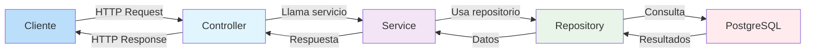

# Prueba Técnica – Sistema de Productos con Precios Históricos

Este proyecto es la solución a la prueba técnica alojada en el repositorio https://github.com/adriancataland/senior-java-tech-challenge.git. 

Consta de una **API REST** desarrollada con **Spring Boot**, enfocada en la gestión de productos y sus precios asociados. 
Incluye operaciones de CRUD para productos y precios, con validaciones de negocio, y documentación automática mediante **Springdoc OpenAPI**.

---
## Instrucciones para compilar y ejecutar

### Requisitos previos
- **Java 21** instalado y configurado en el PATH.
- **Gradle** instalado para compilar y ejecutar el proyecto.
- **PostgreSQL** en ejecución con la base de datos `productsdb` creada.
- Usuario de PostgreSQL con permisos de lectura/escritura (configurado en `application.yml`).

### 1. Clona el repositorio:

```bash
git clone https://github.com/javirc02/PT-Slashmobility-Javier.git
cd senior-java-tech-challenge-mango
```
### 2. Configuración de la Base de Datos
```bash
# Crear base de datos en PostgreSQL
CREATE DATABASE productsdb;

# Crear usuario (opcional)
CREATE USER postgres WITH PASSWORD 'postgres';
GRANT ALL PRIVILEGES ON DATABASE productsdb TO postgres;
```
### 3. Compila y ejecuta el proyecto usando Gradle:
```bash
./gradlew build
./gradlew bootRun
```
### 4. La API estará disponible en:
```
http://localhost:8080
```
---
## Documentación de la API
Una vez ejecutado el proyecto, puedes acceder a la documentación de la API accediendo a:
- **Swagger UI**: http://localhost:8080/swagger-ui.html
- **OpenAPI JSON**: http://localhost:8080/v3/api-docs
---
## Testing
### Ejecutar tests
```bash
./gradlew test
```
### Reporte de testing
```
products/build/reports/tests/test/packages/mango.challenge.products.service.html
```
---

## Tecnologías y justificación técnica

### Java 21
- Última versión LTS, lo que nos asegura mantener la aplicación con una versión de java con soporte el máximo tiempo posible.

### Spring Framework 3.5.5 + Spring Boot
- Spring Boot simplifica la configuración, arranque y despliegue, permitiendo centrarse en la lógica de negocio.

### Spring Web / Spring Data JPA / Hibernate
  - **Spring Web:** Permite exponer la lógica de negocio a través de endpoints REST de manera sencilla y estandarizada.  
  - **Spring Data JPA / Hibernate:** Facilitan la persistencia de datos, manejo de transacciones y consultas complejas de manera declarativa, reduciendo boilerplate y aumentando la mantenibilidad del código.

### PostgreSQL
- Base de datos relacional confiable, con soporte a transacciones, índices avanzados y escalabilidad.
- Una base de datos relacional es ideal para este proyecto ya que los modelos están muy acotados y nos permite mantener la integridad de los datos como por ejemplo evitar duplicidades de precios en fechas concretas con retricciones de tabla y contar con un buen rendimiento en las consultas gracias a la posibilidad de la creación de índices.

### Gradle
- Sistema de construcción flexible y rápido, que facilita la gestión de dependencias y tareas de construcción.  

### Arquitectura MVC con Service y Repository
- **Modelo:** Representa entidades de negocio (Product, Price).  
- **Vista:** Aunque no se usa frontend directo, la capa REST actúa como interfaz.  
- **Controlador:** Gestiona solicitudes HTTP y respuestas.  
- **Service:** Contiene la lógica de negocio, validaciones y reglas de negocio.  
- **Repository:** Encapsula la persistencia de datos y comunicación con la base de datos.

  
**Beneficios:** Código más limpio, testable, mantenible y fácil de escalar. Ideal para este servicio de poca embergadura ya que otro tipo de arquitecturas habrían complicado innecesariamente la implementación.

### Springdoc OpenAPI 2.8.13
- Genera documentación automática de la API, compatible con Spring Boot 3.5.5 y evitando errores de incompatibilidad.

### Flyway
- Muy útil para gestionar la evolución de la base de datos de forma automática y controlada. Permite versionar la estructura y los datos iniciales mediante scripts numerados, garantizando que todos los entornos (desarrollo, pruebas y producción) tengan la misma configuración.
- 
### Lombok
- Utilizado para facilitar y agilizar el desarrollo con java, además de mantener el código más limpio. Evita tener que definir manualmente tanto getters, setters, contructores o builders ya que al añadir las anotaciones pertinentes ya nos genera estos métodos.

## Decisiones de diseño de la API
- Validaciones de negocio robustas (fechas, solapamientos, existencia de entidad).  
- Manejo de errores mediante excepciones con mensajes claros para facilitar depuración.
- Los endpoints de consulta de productos y precios incluyen los IDs correspondientes, permitiendo al usuario de la API identificar cada recurso y utilizarlos para llamar a otros endpoints relacionados.
- Se ha utilizado **PATCH** para actualizar precios parcialmente sin sobrescribir otros campos.  
- Se ha definido versionado de los endpoints a nivel controlador, añadiendo en el ```@RequestMapping``` de cada controlador el número de versión. Por ejemplo la ruta para los products sería ```/api/v1/products```. 
  Esto permite que todos los endpoints de ese controlador vayan sobre la misma versión. En caso de que sea necesario modificar un endpoint de manera incompatible con versiones anteriores, se puede crear una nueva versión del controlador, por ejemplo ```/api/v2/products```, sin afectar a los clientes que aún utilizan la versión antigua.

## Mejoras y supuestos
- Cada precio pertenece a un único producto.
- Manejo de errores centralizado y claro.
- Carga de ejemplos en la base de datos para simplificar las pruebas.
- Colección de postman lista para ser importada para poder probar todos los endpoints.
- Configuración lista para PostgreSQL con posibilidad de cambiar base de datos fácilmente.

## Implementaciones opcionales 

### Endpoint para actualizar o eliminar precios
Se han implementado los endpoints necesarios apra actualizar y eliminar precios.
- **PATCH** /v1/products/{id}/prices/{id} : Permite modificar los campos que deseemos del precio de un producto 
- **DELETE** /v1/products/{id}/prices/{id} : Elimina el precio

### Documentación con swagger
Mencionada en el apartado de **Instrucciones para compilar y ejecutar**.

### Scripts para poblar la base de datos con casos de ejemplo 
Definidos mediante flayway, por lo que se ejecuta al iniciar la aplicación.

### Soporte para paginación, ordenamiento y filtrado en el historial de precios.
Se ha modificado el endpoint de **/v1/products/{id}/prices** para que permita como parámetros:

- `page` y `size`: controlan la paginación de los resultados.
- `sort`: permite ordenar los precios por campos como `initDate` o `value`, en orden ascendente o descendente.
- `date`: filtra el precio vigente para una fecha concreta.
- `fromDate` y `toDate`: filtran los precios cuyo rango de fechas se solapa con el rango especificado.
- `minValue` y `maxValue`: filtran los precios según su valor mínimo o máximo.

Estos cambios permiten consultar de manera flexible los precios de un producto, tanto por rangos de fechas como por valores y ordenamiento, devolviendo resultados paginados.

### Soporte multilenguaje y multi-moneda
Actualmente no implemento soporte para distintos países, idiomas o monedas.

Decido priorizar la gestión de productos y precios con validaciones de fechas y filtros porque el tiempo es un factor clave: implementar traducciones y precios por país habría requerido mucho más desarrollo y complejidad en la base de datos y la lógica de negocio.

Si fuera a implementarlo, podría hacerlo así:

- Crear una tabla ProductTranslation que almacene el productId, locale y las traducciones de name y description. 
- Extender la tabla Price para incluir countryCode, currency y value en la moneda local.
- Ajustar los endpoints para filtrar precios por país y convertir valores según la moneda seleccionada.
- Añadir lógica para seleccionar la traducción correcta del producto según el idioma del usuario.

---
## Colección de postman
Hay una colección de postman de ejemplo que podemos importar a nuestro entorno postman local para tener el acceso a los endpoints ya definido para facilitar la labor de prueba de la API.
Este se encuentra en la ruta:
```
src/main/resources/ProductsAndPrices.postman_collection.json
```


